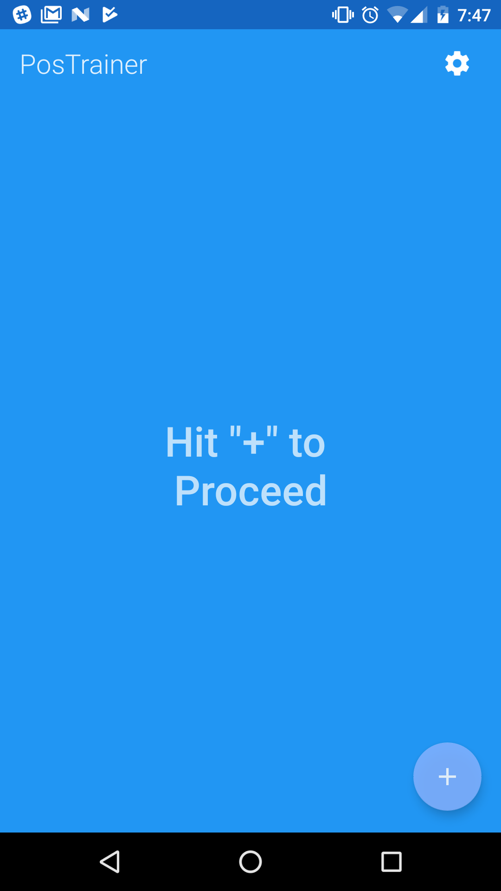
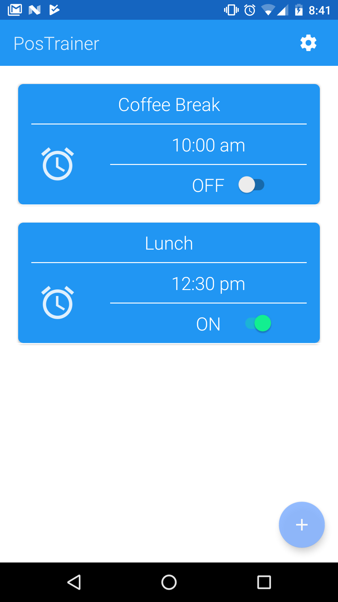
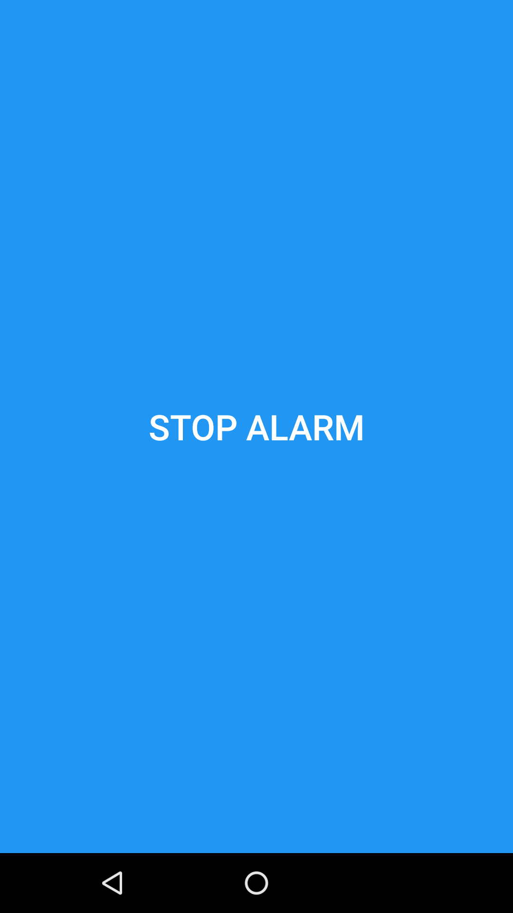
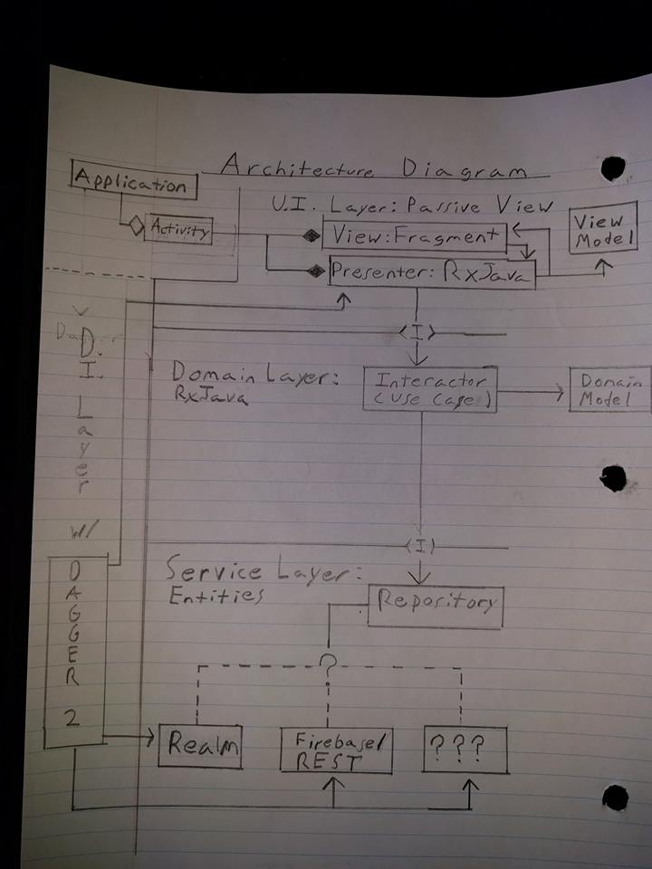

# PosTrainer

## Topics
* [What is PosTrainer?](#what-is-postrainer)
* [Change Log](#change-log)
* [Software Architecture Diagram](#software-architecture-diagram)
* [Can I use the code?](#can-i-use-code-from-this-repo)
* [Project APIs/Concepts](#apis-and-architectures-used)
* [Learning Sources/Inspiration](#sources-and-inspiration)
* [Support Me](#contactsupport-me)
* [License](#license)

## What is PosTrainer?

PosTrainer is an Alarm App which allows the user to set up to 5 Daily Reminders to sit up Straight and/or Perform stretches to combat bad Posture from being a Desk Jockey.

This App has seen over 5 iterations, as it was the second App Idea I ever built. At this time, I'm currently refactoring it to apply Clean Architecture Principles, as well as Dagger 2 for Dependency Injection, RxJava 2 for Concurrency/Communication, and a Realm Database to store the Reminders. Please see my Software Architecture Diagram for a generalized Picture of this Application's Software Architecture.

### AlarmList Component

### AlarmDetail Component

### AlarmReceiver Page Component

### Settings  Component
*Coming Soon*

## Change Log

## Software Architecture Diagram

## Can I use code from this Repo?
Absolutely, pursuant to the project's [LICENSE](LICENSE.md). I primarily learned how to build Profiler by learning from free sources and referencing open source libraries, many of which I list (here)[#sources]. That being said, the logo (whenever I get around to making it) and name are my intellectual creations, so don't use them unless you are linking/reffering to this Repo.

Follow the rules in the license, and you're good.

## APIs and Architectures Used:
This project is greatly inspired by Clean Architecture Principles. Now that I'm more comfortable with RxJava and Dagger 2, I'm confident that I'll be able to execute a modular and highly testable Application on the Android Platform. This project is an attempt to make that idea into an Open Source App.

**Architecture patterns:**
* Model View Presenter (Passive View). Keep Views dumb and simple, so that they don't need to be tested much, if at all (I may write some Espresso Tests, but it isn't high on my priority list).
* Clean Architecture. To complex to summarize in a few sentences; but the basic idea is having three layers of an Enterprise App (Presentation, Domain (Use Case), and Data (Service) layers). This seperation does increase the number of Classes, but the advantage is in simplicity, testability, and modularity to name a few.
* Dependency Injection Layer. This Layer satisfies creation of Dependencies (such as ReminderService.java) so that each part of the App has what it needs, when it needs it. This also decouples Object creation from Classes which shouldn't really be creating Objects in the first place (Seperation of Concerns).

* Dagger 2. D.I. Framework which I use to Inject Presenters, as well as to Inject Objects into my Service Layer.
* RxJava/RxAndroid 2 for concurrency. Rx allows me to create Data Streams which change over time, based on what happens in each Layer.
* Mockito to help with Unit Testing
* Realm for storing Reminders
* Plenty of System Services Like Vibrator, AlarmManager, MediaPlayer, PowerManager.WakeLock

## Sources and Inspiration

Fernando Cejas' Repository and material on Android and Clean Architecture was very useful to me. Being able to see working code is one of the greatest resources, and although I do many things differently (differently, not necessarily better), I don't think I would attempted this without such an awesome reference!

https://github.com/android10/Android-CleanArchitecture

Uncle Bob (Robert C. Martin) explains Clean Architecture in a very practicle and Framework Independent way. You'll want to listen when he speaks on Software Architecture :).

https://www.youtube.com/watch?v=Nsjsiz2A9mg&t=1832s

Martin Fowler eventually broke MVP Architecture into two sub-styles. I currently try to employ "Passive View" as best I can

https://martinfowler.com/eaaDev/PassiveScreen.html

Donn and Kaushik from Fragmented Podcast did an episode on Clean, which also helped my understand a fair bit. Also these guys do an awesome podcast so you should watch it anyway:

http://fragmentedpodcast.com/episodes/11/

## Contact/Support me:
It's my personal goal to create free high-quality content, accesible by anyone who has an Internet connection, as I don't feel ownership over knowledge which has graciously been given to me for free (I've never taken a paid course for Android Development).

That being said, if the 200+ hours of my time spent coding, researching, making learning aids, and producing content for this project, and the effort I take to explain things in a simple and clear way (which I often fail to do), is worth throwing a bit of money at, then please do!

If you're in a position where monetary support isn't an option, then you can also help out by liking/sharing my stuff on Social Media. This helps me with SEO and building an audience, and I greatly appreciate it! Lastly, drop me a comment on one of my videos.

[G+](https://plus.google.com/+wiseass)

[Facebook](https://www.facebook.com/wiseassblog/)

[Twitter](https://twitter.com/wiseAss301)

[Patreon](https://www.patreon.com/bePatron?u=5114325)

[Primary Website](http://wiseassblog.com/)

## License
 * Copyright 2016, The Android Open Source Project
 * 
 * Licensed under the Apache License, Version 2.0 (the "License");
 * you may not use this file except in compliance with the License.
 * You may obtain a copy of the License at
 * 
 *      http://www.apache.org/licenses/LICENSE-2.0
 *
 * Unless required by applicable law or agreed to in writing, software
 * distributed under the License is distributed on an "AS IS" BASIS,
 * WITHOUT WARRANTIES OR CONDITIONS OF ANY KIND, either express or implied.
 * See the License for the specific language governing permissions and
 * limitations under the License.
 *
